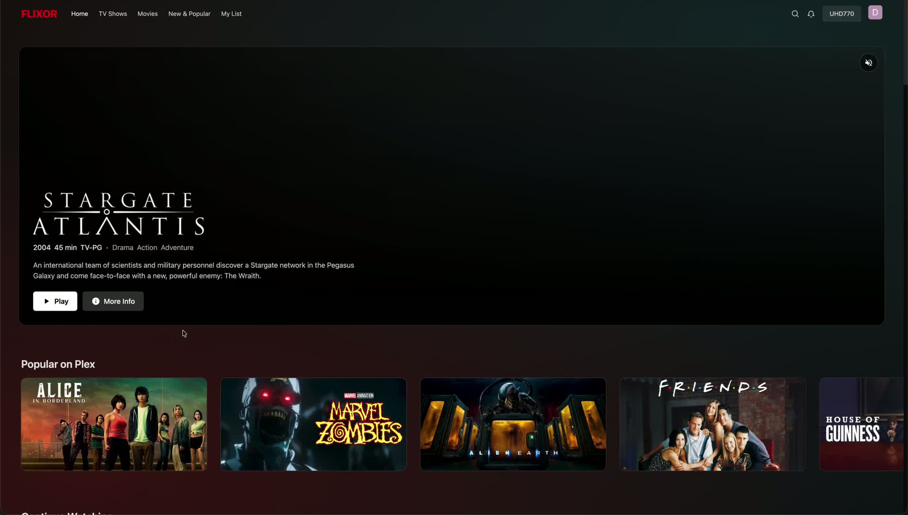
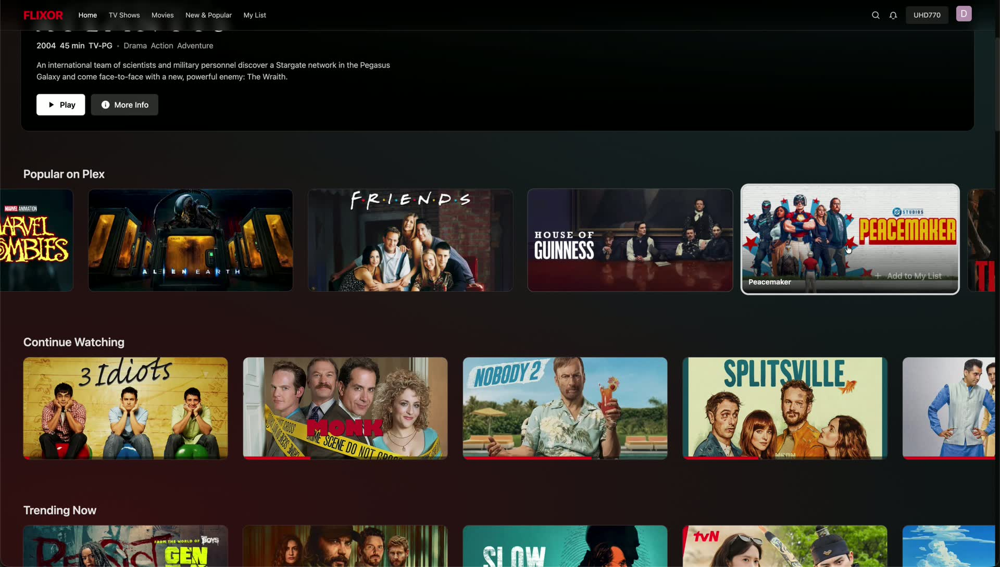
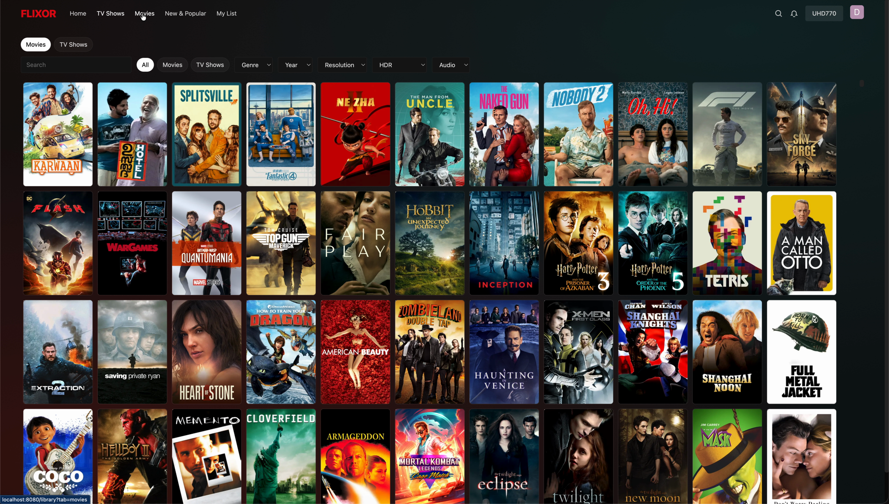
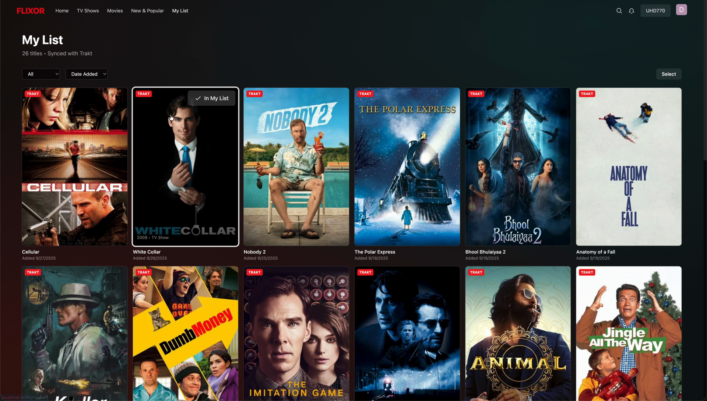
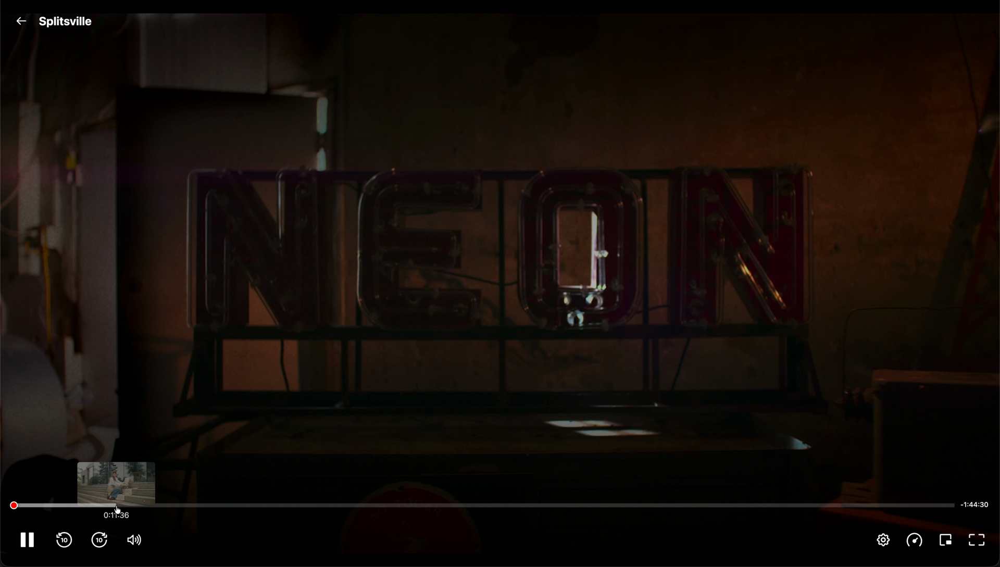
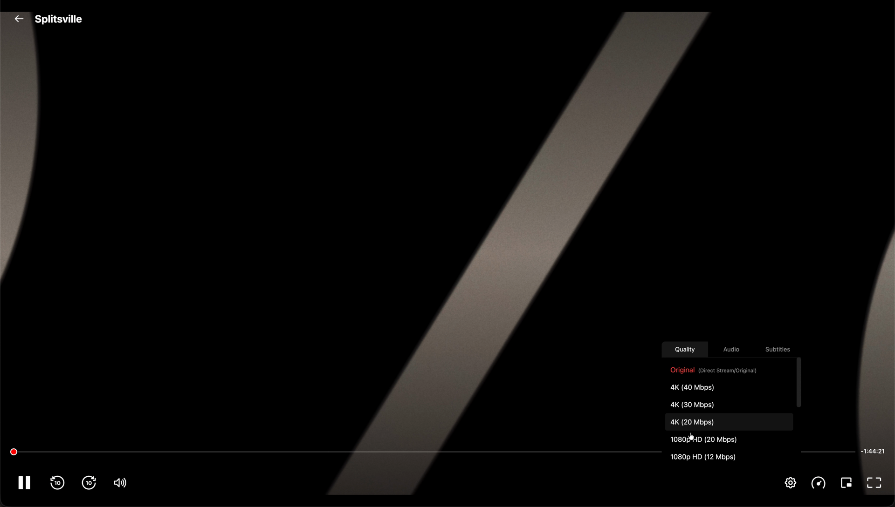
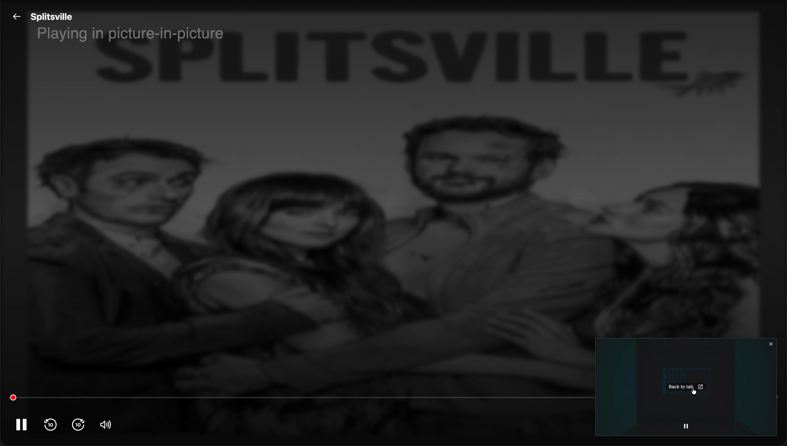
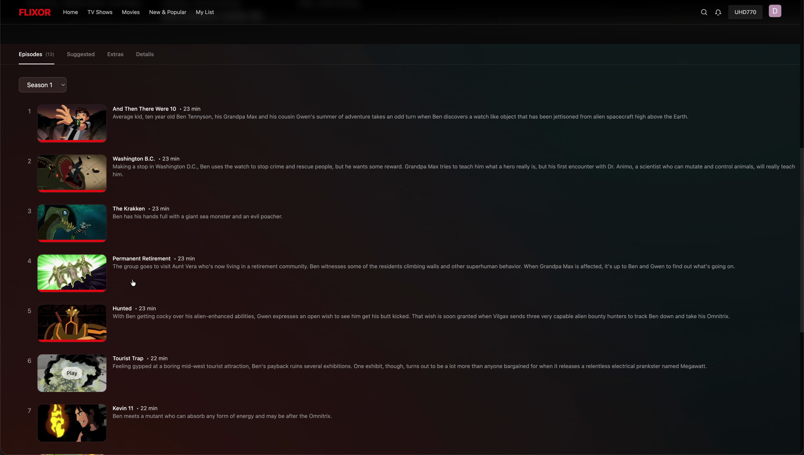
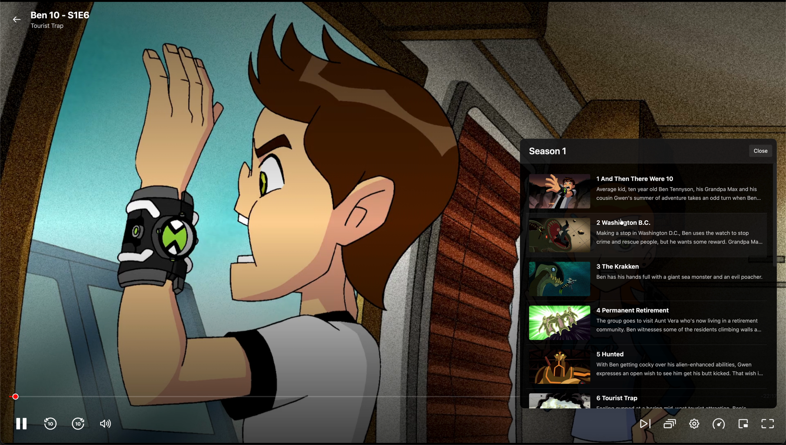

<a id="readme-top"></a>

<!-- PROJECT SHIELDS -->
[![Contributors][contributors-shield]][contributors-url]
[![Forks][forks-shield]][forks-url]
[![Stargazers][stars-shield]][stars-url]
[![Issues][issues-shield]][issues-url]
[![License][license-shield]][license-url]

# Flixor (Cross Platform)

## Description
A fast, Netflix‑style web app, Android, iOS, and MacOS for your Plex library. Browse beautiful rows, see rich details (IMDb/Rotten Tomatoes), and play instantly in your browser with built‑in DASH/HLS playback. Works on any modern desktop or mobile browser.

## Features
- Netflix‑style home: Continue Watching, Trending, Collections, and more
- Built‑in player: DASH/HLS, fullscreen, Picture‑in‑Picture, subtitles
- Rich details: trailers/extras, cast, badges (4K/HDR/Atmos), IMDb/RT ratings
- Smart search and filters; ultra‑fast grids optimized for large libraries
- Recommendations from TMDB/Trakt plus Plex On Deck
- Smooth, responsive UI with image optimization and caching

## Installation

### Docker (recommended)

**Using published image:**
```bash
docker run -d \
  --name flixor \
  -p 8080:80 \
  -e SESSION_SECRET=your-secure-secret-here \
  -v flixor-config:/app/config \
  -v flixor-cache:/app/cache \
  --restart unless-stopped \
  ghcr.io/flixorui/flixor:latest
```

Or with Docker Compose, create a `docker-compose.yml`:
```yaml
services:
  flixor:
    image: ghcr.io/flixorui/flixor:latest
    container_name: flixor
    environment:
      - SESSION_SECRET=your-secure-secret-here
    ports:
      - "8080:80"
    volumes:
      - flixor-config:/app/config
      - flixor-cache:/app/cache
    restart: unless-stopped

volumes:
  flixor-config:
  flixor-cache:
```

Then run:
```bash
docker compose up -d
```

Open `http://localhost:8080` and sign in with Plex.

**Build from source:**
```bash
git clone https://github.com/flixorui/flixor.git
cd flixor
SESSION_SECRET=your-secret docker compose -f docker-compose.prod.yml up -d
```

### Local development

1. Install Node.js 18+ and npm
2. Run: `npm install` then `npm run dev:all`
3. Open `http://localhost:5173` and sign in with Plex

### Notes

- The app calls the backend via relative `/api` so it works from any device on your network.
- Vite dev server is reachable on your LAN. Visit `http://YOUR_COMPUTER_IP:5173` on your phone/another PC.
- If you need to point dev proxy to a different backend, set `VITE_PROXY_TARGET` in `.env` (see `.env.example`).

That’s it—no extra setup needed. The app uses the bundled backend by default; the database is created and migrations run automatically on first start.

## Screenshots











## Star History

[](https://www.star-history.com/#Flixorui/flixor&type=date&legend=top-left)

<!-- MARKDOWN LINKS & IMAGES -->
[contributors-shield]: https://img.shields.io/github/contributors/Flixorui/flixor.svg?style=for-the-badge
[contributors-url]: https://github.com/Flixorui/flixor/graphs/contributors
[forks-shield]: https://img.shields.io/github/forks/Flixorui/flixor.svg?style=for-the-badge
[forks-url]: https://github.com/Flixorui/flixor/network/members
[stars-shield]: https://img.shields.io/github/stars/Flixorui/flixor.svg?style=for-the-badge
[stars-url]: https://github.com/Flixorui/flixor/stargazers
[issues-shield]: https://img.shields.io/github/issues/Flixorui/flixor.svg?style=for-the-badge
[issues-url]: https://github.com/Flixorui/flixor/issues
[license-shield]: https://img.shields.io/github/license/Flixorui/flixor.svg?style=for-the-badge
[license-url]: http://www.gnu.org/licenses/gpl-3.0.en.html
