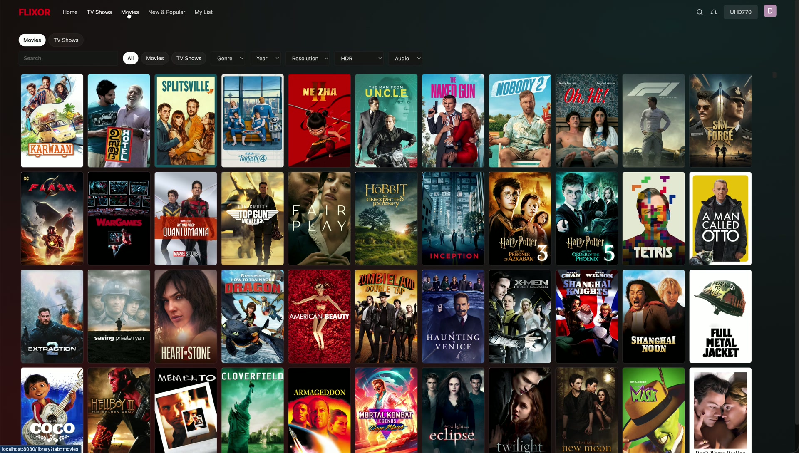

<a id="readme-top"></a>

<!-- PROJECT SHIELDS -->
[![Contributors][contributors-shield]][contributors-url]
[![Forks][forks-shield]][forks-url]
[![Stargazers][stars-shield]][stars-url]
[![Issues][issues-shield]][issues-url]
[![License][license-shield]][license-url]

<div align="center">
  <h1>Flixor</h1>
  <p><strong>A beautiful, Netflix-style client for your Plex library</strong></p>
  <p>Available on Web, macOS, iOS, Android, and tvOS</p>
</div>

---

## About

Flixor is a modern, cross-platform Plex client that brings a Netflix-like experience to your media library. Browse beautiful rows, see rich metadata with ratings from multiple sources, and enjoy powerful playback on any device.

### Supported Platforms

| Platform | Status | Player |
|----------|--------|--------|
| **Web** | Available | HLS.js / DASH.js |
| **macOS** | Available | MPV (HDR, Dolby Vision) |
| **iOS** | Available | KSPlayer |
| **Android** | Available | MPV |
| **tvOS** | In Development | - |

## Features

### Core Experience
- **Netflix-style UI** - Continue Watching, Trending, Collections, Watchlist, and more
- **Rich metadata** - Trailers, cast info, tech badges (4K/HDR/Atmos/DTS-X)
- **Smart search** - Search across Plex and TMDB with intelligent filtering
- **Ultra-fast grids** - Optimized for libraries with thousands of items
- **Cross-platform sync** - Watch progress syncs across all your devices

### Playback
- **Web**: Built-in DASH/HLS player with Picture-in-Picture and subtitle support
- **macOS**: MPV-powered with HDR, Dolby Vision, and advanced audio passthrough
- **Mobile**: Native players with background playback and streaming quality options

### Integrations
| Service | Description |
|---------|-------------|
| **TMDB** | Movie/TV metadata, posters, backdrops, trailers |
| **Trakt** | Watch history sync, scrobbling, ratings, watchlists |
| **MDBList** | Aggregated ratings from IMDb, RT, Letterboxd, Metacritic |
| **Overseerr** | Request movies and shows directly from the app |

### Mobile-Specific Features
- OTA (Over-the-Air) updates without app store
- Configurable bottom navigation tabs
- Optional TMDB search integration
- Landscape continue watching cards with progress indicators

## Screenshots

<details>
<summary>Click to view screenshots</summary>




</details>

## Installation

### Web App (Docker)

**Using the published image:**
```bash
docker run -d \
  --name flixor \
  -p 8080:80 \
  -e SESSION_SECRET=your-secure-secret-here \
  -v flixor-config:/app/config \
  -v flixor-cache:/app/cache \
  --restart unless-stopped \
  ghcr.io/flixorui/flixor:latest
```

**Using Docker Compose:**
```yaml
services:
  flixor:
    image: ghcr.io/flixorui/flixor:latest
    container_name: flixor
    environment:
      - SESSION_SECRET=your-secure-secret-here
    ports:
      - "8080:80"
    volumes:
      - flixor-config:/app/config
      - flixor-cache:/app/cache
    restart: unless-stopped

volumes:
  flixor-config:
  flixor-cache:
```

```bash
docker compose up -d
```

Open `http://localhost:8080` and sign in with Plex.

### macOS

1. Download the latest `.dmg` from [Releases](https://github.com/Flixorui/flixor/releases)
2. Drag Flixor to your Applications folder
3. Open and sign in with Plex

**Requirements:** macOS 13.0 (Ventura) or later

### iOS / Android

Download from the [Releases](https://github.com/Flixorui/flixor/releases) page or join the TestFlight/beta program.

The mobile apps support OTA updates - you'll receive update notifications within the app.

## Development

### Prerequisites
- Node.js 18+
- npm or yarn

### Web Frontend
```bash
cd web_frontend
npm install
npm run dev
```

### Mobile App
```bash
cd apps/mobile
npm install
npx expo start
```

### macOS App

Open `apps/macos/FlixorMac.xcodeproj` in Xcode and build.

### Full Stack (Web + Backend)
```bash
npm install
npm run dev:all
```

The dev server runs on `http://localhost:5173` and is accessible on your local network.

## Configuration

### Environment Variables

| Variable | Description | Default |
|----------|-------------|---------|
| `SESSION_SECRET` | Secret for session encryption | Required |
| `VITE_PROXY_TARGET` | Backend URL for dev proxy | `http://localhost:3000` |

### App Settings

Settings are available in-app under Settings:

- **Catalogs** - Choose which Plex libraries appear
- **Home Screen** - Configure hero and row visibility
- **Integrations** - Set up TMDB, Trakt, MDBList, Overseerr
- **Playback** - Video player preferences
- **Appearance** - Episode layout, backdrop options

## OTA Updates (Mobile)

The mobile app supports self-hosted OTA updates. To publish an update:

```bash
export FLIXOR_OTA_UPLOAD_KEY=your-upload-key
./scripts/publish-ota-update.sh
```

Users will receive update notifications on app launch.

## Community

- [Discord](https://discord.gg/flixor) - Join the community
- [Reddit](https://www.reddit.com/r/flixor/) - Follow updates
- [GitHub Issues](https://github.com/Flixorui/flixor/issues) - Report bugs

## Contributing

Contributions are welcome! Please read our contributing guidelines before submitting a PR.

1. Fork the repository
2. Create your feature branch (`git checkout -b feature/amazing-feature`)
3. Commit your changes (`git commit -m 'Add amazing feature'`)
4. Push to the branch (`git push origin feature/amazing-feature`)
5. Open a Pull Request

## License

Distributed under the GPL-3.0 License. See `LICENSE` for more information.

## Star History

[](https://star-history.com/#Flixorui/flixor&Date)

---

<p align="center">
  Made with care for the Plex community
</p>

<!-- MARKDOWN LINKS & IMAGES -->
[contributors-shield]: https://img.shields.io/github/contributors/Flixorui/flixor.svg?style=for-the-badge
[contributors-url]: https://github.com/Flixorui/flixor/graphs/contributors
[forks-shield]: https://img.shields.io/github/forks/Flixorui/flixor.svg?style=for-the-badge
[forks-url]: https://github.com/Flixorui/flixor/network/members
[stars-shield]: https://img.shields.io/github/stars/Flixorui/flixor.svg?style=for-the-badge
[stars-url]: https://github.com/Flixorui/flixor/stargazers
[issues-shield]: https://img.shields.io/github/issues/Flixorui/flixor.svg?style=for-the-badge
[issues-url]: https://github.com/Flixorui/flixor/issues
[license-shield]: https://img.shields.io/github/license/Flixorui/flixor.svg?style=for-the-badge
[license-url]: http://www.gnu.org/licenses/gpl-3.0.en.html
